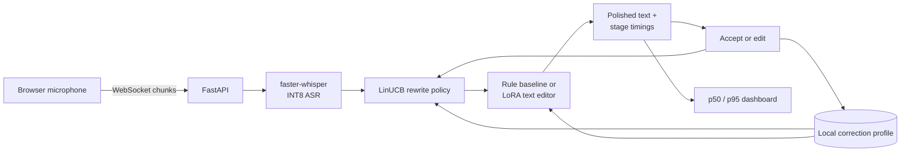

# VoxAdapt

VoxAdapt is a privacy-first voice post-editor that turns rough speech into ready-to-send text and
learns how much editing each user wants. It combines local speech recognition, a replaceable
language-model post-editor, correction memory, and a contextual bandit that adapts between
`verbatim`, `balanced`, and `polished` rewriting.

The project is intentionally an ML systems project rather than a thin speech-model wrapper:

- **Latency is a first-class output.** Every request records ASR, profile lookup, policy selection,
  post-editing, and end-to-end latency; the service exposes rolling p50/p95 measurements.
- **Personalization is observable and reversible.** User corrections produce an inspectable local
  profile of preferred spellings and channel-specific style. Users can export or delete it.
- **The policy learns online.** A LinUCB contextual bandit selects rewrite strength using utterance
  length, disfluency rate, and destination channel, then learns from accepted or edited suggestions.
- **Research and serving use the same interface.** The deterministic baseline, a Hugging Face base
  model, and a LoRA-tuned model all implement one `TextPolisher` contract and run through the same
  evaluation harness.

## Architecture



VoxAdapt streams audio bytes to the service and commits an utterance at the end of a recording.
This is not presented as incremental token streaming: ASR runs on the committed utterance, which is
the honest scope of the current prototype.

## Quick start

Requirements: Python 3.11+ and [`uv`](https://docs.astral.sh/uv/).

```bash
uv sync --extra dev
uv run pytest
uv run voxadapt evaluate data/sample_eval.jsonl --output artifacts/baseline.json
uv run voxadapt serve
```

Open the API docs at <http://127.0.0.1:8000/docs>. The default service uses the deterministic
post-editing baseline and keeps ASR disabled, so tests and text-mode development require no model
download.

### Enable local speech recognition

```bash
uv sync --extra asr
VOXADAPT_ENABLE_ASR=1 VOXADAPT_ASR_MODEL=tiny.en uv run voxadapt serve
```

`faster-whisper` uses CTranslate2. The default `int8` CPU mode is suitable for a laptop; model
weights download on first use. Use `VOXADAPT_ASR_COMPUTE=float32` for an explicit comparison.
The documented M1 Pro benchmark kept both modes below 400 ms p95; on that hardware, float32 was
slightly faster, so the repository does not assume quantization is automatically better.

### Run the browser client

```bash
cd frontend
npm install
npm run dev
```

The React client supports text-mode iteration and microphone recording. Audio transcription needs
the ASR-enabled backend above.

## API

Polish an existing transcript:

```bash
curl -s http://127.0.0.1:8000/v1/polish \
  -H 'content-type: application/json' \
  -d '{"user_id":"demo","channel":"email","transcript":"um send the api report tomorrow"}'
```

Send the returned interaction and the user's final edit to `/v1/feedback`. The reward is `1.0` for
an accepted suggestion; otherwise it is scaled by similarity between the suggestion and final text.
This avoids treating every edit as a total failure.

Other endpoints:

| Endpoint | Purpose |
| --- | --- |
| `POST /v1/transcribe` | Upload an audio file for ASR and post-editing |
| `WS /v1/stream/{user_id}` | Send browser audio chunks, then a `commit` event |
| `POST /v1/feedback` | Update the correction profile and rewrite policy |
| `GET /v1/metrics` | Return rolling count, mean, p50, and p95 by stage |
| `GET /v1/users/{id}/profile` | Inspect the local personalization state |
| `DELETE /v1/users/{id}` | Delete a user's correction history |

## LoRA experiment

The model experiment fine-tunes `google/flan-t5-small` as a lightweight spoken-to-written
post-editor. Synthetic corruption adds filler words and repeated tokens to clean, deterministic
sentences. It is a controlled starting point, not a substitute for a representative speech corpus.

```bash
uv run python scripts/generate_training_data.py --examples 1000
uv sync --extra ml
uv run python training/train_lora.py --dataset data/train.jsonl
```

Point `VOXADAPT_MODEL` directly at the saved adapter directory. VoxAdapt detects the PEFT config,
loads the base model, and applies the adapter. Both baseline and learned variants can be evaluated
with the same JSONL schema:

```json
{"raw":"um send this to sarah","reference":"Send this to Sarah.","channel":"email","replacements":{"sarah":"Sarah"}}
```

## Evaluation protocol

The included harness reports:

- exact-match rate;
- character-level similarity;
- token F1 as a transparent content-overlap measure;
- warm per-example p50, p95, and mean post-editing latency;
- individual predictions for error analysis.

For defensible portfolio numbers, benchmark at least 100 held-out utterances, record the machine and
model configuration, run one warm-up pass, and report the median of five runs. Measure cold model
startup separately. Do not compare ASR configurations on different audio or claim sub-500 ms
performance unless end-to-end measurements support it.

Measured results, including an unfavorable quantization comparison and the learned editor's content-
deletion failure case, are reported in [`benchmarks/README.md`](benchmarks/README.md). Keeping those
results is intentional: this project treats error analysis as part of the deliverable.

## Repository layout

```text
src/voxadapt/         API, ASR adapters, bandit, personalization, pipeline, evaluation
training/             LoRA fine-tuning entry point
scripts/              reproducible synthetic-data and benchmark utilities
data/                 small reviewable evaluation fixtures
frontend/             React/TypeScript microphone and feedback client
tests/                unit, API, persistence, policy, and evaluation tests
docs/                 system design and experiment methodology
```

## Design boundaries

- VoxAdapt does **not** train an ASR model from scratch.
- The browser transports audio in chunks, but the prototype transcribes at utterance commit.
- Personalization is local SQLite state; there is no claim of global distributed serving.
- Synthetic examples test mechanics. Resume metrics will come only from a documented held-out run.

These boundaries keep the system credible as a focused new-grad portfolio project while leaving
clear extensions: partial ASR, speaker-adapter training, multilingual evaluation, semantic metrics,
and batched inference.

## License

MIT
